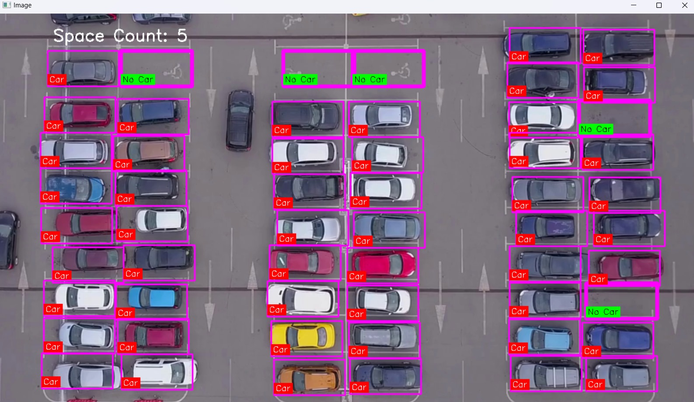

# Advanced Car Parking Management System Powered by Deep Learning

This project is an advanced car parking management system that utilizes deep learning techniques to monitor and manage parking spaces. The system is powered by a VGG16 model to classify parking spaces as either "occupied" or "vacant". Additionally, OpenCV techniques are used for image cropping and annotation to manage and visualize parking space data.

## Features
- **Deep Learning Model:** Utilizes the VGG16 architecture pre-trained on ImageNet to classify parking spaces.
- **Image Cropping:** Employs OpenCV to crop images of parking spaces and save them for further analysis.
- **Interactive Annotation:** Allows users to interactively select and deselect parking space regions using mouse clicks.
- **Data Persistence:** Uses Pickle to save and load parking space positions and configurations.

## Learning outcome
1. Deep Learning Model Implementation
- **Gained hands-on experience with the VGG16 architecture, including loading pre-trained models and applying them to image classification tasks.**
- **Improved understanding of how to adapt deep learning models for specific tasks such as car detection in parking spaces.**
2. Image Processing with OpenCV
- **Developed skills in using OpenCV for image manipulation, including cropping and resizing images.**
- **Learned to implement interactive features for image annotation and modification using mouse events.**
3. Data Management and Persistence
- **Acquired knowledge in using Pickle for saving and loading data, which is essential for managing state and configurations in machine learning projects.**
- **Implemented data persistence to manage parking space positions and ensure the system can be easily updated and reused.**
4. Practical Application of Machine Learning
- **Applied theoretical knowledge of deep learning in a practical scenario, demonstrating the ability to integrate machine learning models into real-world applications.**
- **Enhanced problem-solving skills by addressing challenges related to image classification and object detection in a specific domain.**
5. Project Integration
- **Gained experience in integrating various components of a project, such as model prediction, image processing, and user interaction, into a cohesive system.**
- **Developed a deeper understanding of how different technologies and techniques can work together to solve complex problems.**
